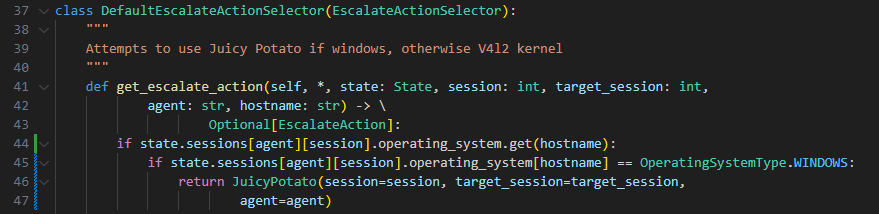
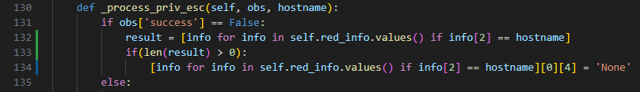
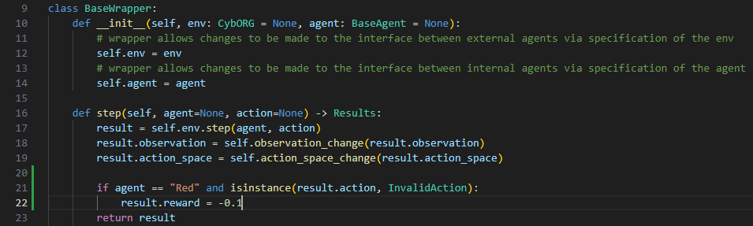

<a name="readme-top"></a>
<br />
<div align="center">
<h3 align="center">CSE 233 Project</h3>

  <p align="center">
    Training Red Adversarial Agent to Compromise Cage 2 Network
  </p>
</div>


<!-- ABOUT THE PROJECT -->
## About The Project

The project involves training a reinforcement learning agent to act as an attacker in a simulated network environment. Using a modified version of the CybORG environment, groups develop a red agent to compromise an Operational Server while a blue agent defends it. Key tasks include modifying agent functions and training processes, with performance evaluated based on rewards gained in the simulation.

<p align="right">(<a href="#readme-top">back to top</a>)</p>


<!-- GETTING STARTED -->
## Getting Started

There are two solutions we provide of a Red Agent compromising the Cage 2 Network. The First Agent uses a PPO algorithm based on <a href=https://github.com/john-cardiff/-cyborg-cage-2>John Cardiff's</a> solution, which is based on a blue agent defending. This implementation required some minor changes to decoys and decoys states to work for a red agent. The Second Agent uses a hard coded strategy which exploits the behavior of the given blue agent. By waiting at least two timesteps before attacking, the defense is tricked into believing there is no threat and the red agent is able to attack the network freely. This attack is implemented by copying the moves of the Bline agent, but it can be set to copy Meander as well.</a>

### PPO Red Agent Approach

Since the current state of CybORG did not support a Red Agent adversary changes needed to be made to CybORG for error checking and rewards. Due to this we have created a docker image that contains these CybORG changes as well as our red agent implementation. To download the docker image follow the below steps:
* Step 1 (8GB image due to CybORG environment and dependencies, may take a while to download):
  ```sh
  docker pull sammyt24/cse233_project_container:v1.0
  ```
* Step 2 *:
  ```sh
  docker run -it sammyt24/cse233_project_container:v1.0
  ```
* Step 3:
  ```sh
  cd /cse_233_project/CSE233_Cage2_Project/
  ```
* Step 4 (Should produce a reward score of ~28):
  ```sh
  python3 red_evaluation.py
  ```

### Static Sleep/BlineAgent
 
To demonstrate this implementation we have added a new agent that performs the recommended initial sleep cycles at the start of an episode and then follows with performing the actions from a BlineAgent. The code for this can be found in red_evaluation_static.py and LateStartAgent.py. This Agent produces an average reward of 190 over 100 episodes. To demonstrate this run the below command in the top directory of the repository:
* Step 1:
   ```sh
   cd /cse_233_project/CSE233_Cage2_Project/
   ```
* Step 2 (Should produce a reward score of ~190):
   ```sh
   python3 red_evaluation_static.py
   ```

<p align="right">(<a href="#readme-top">back to top</a>)</p>


### Changes to CybORG
 
We performed the following Changes to CybORG to make our implementation work.
* Adding error checking to PrivilegeEscalation.py to avoid a "Key Error"  when trying to access host operating system types:


* Also associated with PrivilegeEscalation Key Error.


* Changing the reward amount for an invalid action performed by the red agent, prior to this change the red agent was awarded a positive reward when 
it should be a negative reward.


<p align="right">(<a href="#readme-top">back to top</a>)</p>


<!-- CONTACT -->
## Team Members

* Jimmy Franknedy
* Neel Apte
* Gavin Cooke
* Sammy Tesfai


<!-- ACKNOWLEDGMENTS -->
## References

* https://github.com/john-cardiff/-cyborg-cage-2/tree/main/Agents

<p align="right">(<a href="#readme-top">back to top</a>)</p>
